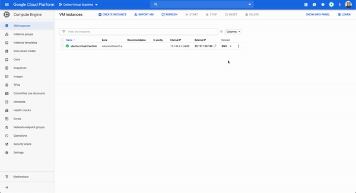

# Config SSH
My personal cloud coding environment powered by [Coder](https://github.com/cdr/code-server) and [Google Cloud](https://cloud.google.com/).

## Setup your Google Cloud environment
Create a [VM instance](https://console.cloud.google.com/compute/instancesAdd) under Compute Engine.
- Name it however you want
- Region should be __asia-southeast1 (Singapore)__ and the zone should be __asia-southeast1-a__
- Machine family should be __General-purpose__
- Machine series should be __N1__
- Machine type should be __Custom__ with __4 cores (vCPU)__ and __8gb memory__
- Do not deploy container Image to the VM instance
- Boot disk should be __Ubuntu 18.04 LTS__
- Do not change the configuration of __Identity and API access__
- Set the firewall to allow both HTTP and HTTPS traffic

## Connect to the VM instance
You need to [SSH](https://cloud.google.com/compute/docs/instances/connecting-advanced#thirdpartytools) inside the VM instance first before doing anything else:



## Run Visual Studio Code
You must first have Docker installed before running the following command:
```
docker run -it -p 127.0.0.1:8080:8080 -v "${HOME}/.local/share/code-server:/home/coder/.local/share/code-server" -v "$PWD:/home/coder/project" codercom/code-server:v2
```

## Video Reference
There's also a [video](https://www.youtube.com/watch?v=N5WojMutddQ) that you can watch by Fireship.

## Warning
Remember to turn off the instance after you're done using it! It will be costly if you keep it running.
